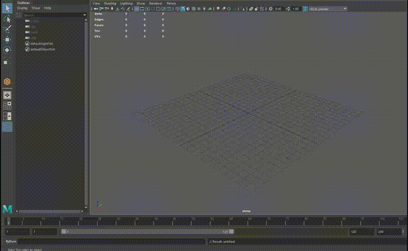

# maya-game-engine-autosetup

I've always found it a little unwieldy how Maya reverts to its own preset units when creating a new file. Especially as a multi-engine developer, I've found it a pain over time to constantly adjust units depending on whether I was using Unity or Unreal for a given projet.

Just drag these two python files into your *scripts* folder (*\Users\You\Documents\maya\scripts*) and when creating a new Maya scene after opening it just run either of these in the python command line:

- *import setupUnreal*
- *import setupUnity*

And the up-axis, working units, animation framerate and grid size will automatically be adjusted for best import results in that given engine! If you create a new scene after that without closing Maya, just run

- *reload(setupUnreal)*
- *reload(setupUnity)*

If at any time the grid goes weird just create a new scene and run the *reload()* method again.

No more tiny models in Unity or weirdly-rotated static meshes in Unreal!